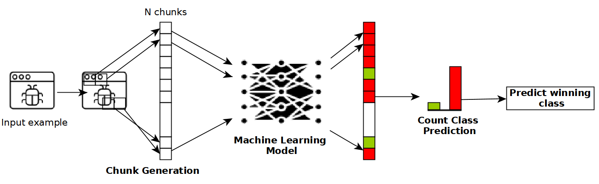

# Certified Robustness of Static Deep Learning-based Malware Detectors against Patch and Append Attacks

This is the code implementing our approach for the paper 
["Certified Robustness of Static Deep Learning-based Malware Detectors against Patch and Append Attacks"](https://dl.acm.org/doi/10.1145/3605764.3623914), presented at the 16th ACM Workshop on Artificial Intelligence and Security (AISEC'23),
collocated with ACM CCS 2023.

## Summary

Here are the main highlights of our paper:
* Robust Malware Detector: We introduce a novel approach inspired by (de)randomized smoothing that enhances the robustness of static deep learning-based malware detectors against adversarial attacks.
* Certified Robustness: We provide a certification procedure to calculate the certified robustness of end-to-end malware detectors against Patch and Append attacks.
* Adversarial Defense: Our method increases the detection accuracy against adversarial attacks that manipulate malware executables, making it harder for attackers to evade detection.
* Experimental Results: We provide empirical evidence of the effectiveness of our approach against state-of-the-art evasion attacks.

## Abstract

Machine learning-based (ML) malware detectors have been shown to be susceptible to adversarial malware examples. Given the vulnerability of deep learning detectors to small changes on the input file, we propose a practical and certifiable defense against patch and append attacks on malware detection. Our defense is inspired by the concept of (de)randomized smoothing, a certifiable defense against patch attacks on image classifiers, which we adapt by: (1) presenting a novel chunk-based smoothing scheme that operates on subsequences of bytes within an executable; (2) deriving a certificate that measures the robustness against patch attacks and append attacks. Our approach works as follows: (i) during the training phase, a base classifier is trained to make classifications on a subset of continguous bytes or chunk of bytes from an executable; (ii) at test time, an executable is divided into non-overlapping chunks of fixed size and our detection system classifies the original executable as the majority vote over the predicted classes of the chunks. Leveraging the fact that patch and append attacks can only influence a certain number of chunks, we derive meaningful large robustness certificates against both attacks. To demonstrate the suitability of our approach we have trained a classifier with our chunk-based scheme on the BODMAS dataset. We show that the proposed chunk-based smoothed classifier is more robust against the benign injection attack and state-of-the-art evasion attacks in comparison to a non-smoothed classifier.



## Dependencies
```
pip install wandb
pip install scikit-learn
pip install tqdm
```

You also need to install Pytorch.

## Citing
If you find this work useful in your research, please consider citing:
```
@inproceedings{10.1145/3605764.3623914,
    author = {Gibert, Daniel and Zizzo, Giulio and Le, Quan},
    title = {Certified Robustness of Static Deep Learning-Based Malware Detectors against Patch and Append Attacks},
    year = {2023},
    isbn = {9798400702600},
    publisher = {Association for Computing Machinery},
    address = {New York, NY, USA},
    url = {https://doi.org/10.1145/3605764.3623914},
    doi = {10.1145/3605764.3623914},
    abstract = {Machine learning-based (ML) malware detectors have been shown to be susceptible to adversarial malware examples. Given the vulnerability of deep learning detectors to small changes on the input file, we propose a practical and certifiable defense against patch and append attacks on malware detection. Our defense is inspired by the concept of (de)randomized smoothing, a certifiable defense against patch attacks on image classifiers, which we adapt by: (1) presenting a novel chunk-based smoothing scheme that operates on subsequences of bytes within an executable; (2) deriving a certificate that measures the robustness against patch attacks and append attacks. Our approach works as follows: (i) during the training phase, a base classifier is trained to make classifications on a subset of continguous bytes or chunk of bytes from an executable; (ii) at test time, an executable is divided into non-overlapping chunks of fixed size and our detection system classifies the original executable as the majority vote over the predicted classes of the chunks. Leveraging the fact that patch and append attacks can only influence a certain number of chunks, we derive meaningful large robustness certificates against both attacks. To demonstrate the suitability of our approach we have trained a classifier with our chunk-based scheme on the BODMAS dataset. We show that the proposed chunk-based smoothed classifier is more robust against the benign injection attack and state-of-the-art evasion attacks in comparison to a non-smoothed classifier.},
    booktitle = {Proceedings of the 16th ACM Workshop on Artificial Intelligence and Security},
    pages = {173–184},
    numpages = {12},
    keywords = {evasion attacks, randomized smoothing, machine learning, adversarial defense, certified robustness, malware detection},
    location = {, Copenhagen, Denmark, },
    series = {AISec '23}
}
```

## Collaborators and Funding
A huge thanks to my co-authors, Giulio Zizzo from IBM Research Europe and Quan Le from CeADAR, Ireland's Centre for 
Artificial Intelligence. In addition, I would also like to thank Enterprise Ireland for funding this work under the Marie Sklodowska Curie Career Fit PLUS grant.
